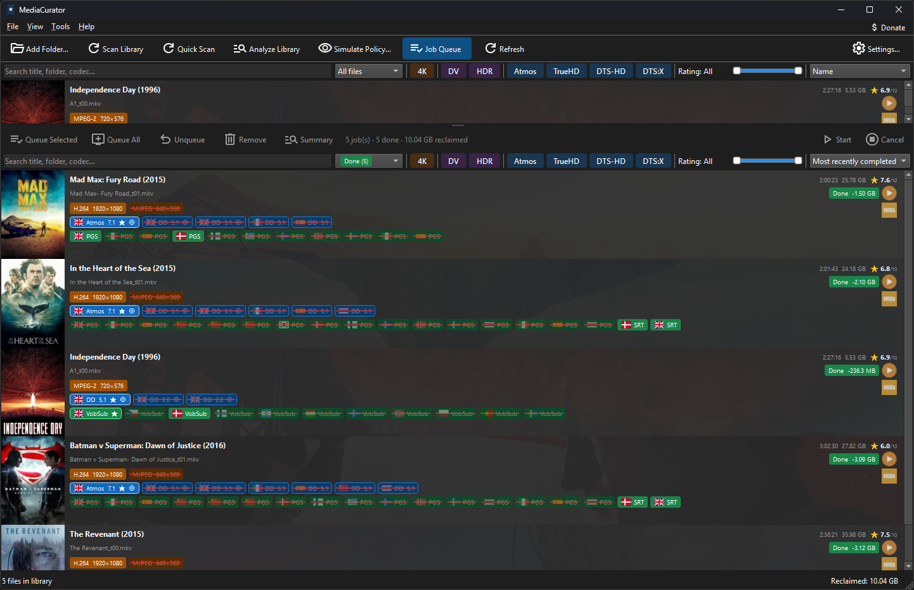

# MediaCurator

**MediaCurator** is a cross-platform desktop application that helps you reclaim hard drive space by intelligently stripping unwanted audio tracks and subtitle streams from your movie collection — without re-encoding the video.

## What It Does

Modern movie files often ship with 8–15 audio tracks covering every language used in distribution, plus multiple subtitle streams, commentary tracks, and secondary mixes. If you only watch films in one or two languages, all of those extra streams are dead weight. A typical Blu-ray rip can carry 2–3 GB of audio tracks you will never use.

MediaCurator scans your library, identifies which tracks you actually want, and queues up lossless remux operations (via **mkvmerge**) to remove the rest. Because the video stream is never touched, there is zero quality loss and no re-encoding — processing is far faster than a transcode, though large files can still take several minutes.

**Practical savings:** removing a 5.1 DTS-HD MA English track plus a Dolby Atmos track from a 4K Blu-ray rip can save 2–4 GB per file. For a library of 200 films that is 400–800 GB — the equivalent of a mid-size NAS drive.

## Screenshots

For a small test library of 5 movies, here is what MediaCurator looks like in action:

| Library view | "What If" simulation |
|---|---|
| <br>*Every file scanned with full stream metadata — audio, subtitles, resolution, and HDR format at a glance.* | <br>*Preview affected files and estimated space savings across the whole library before creating a single job.* |

| Job queue | Done jobs — space reclaimed |
|---|---|
| <br>*Proposed track removals queued for review — nothing is touched until you approve.* | <br>*Finished jobs show exactly how much space was reclaimed, file by file.* |

After setting rules to retain only english and danish audio and subtitle tracks (no commentary), the estimate is that we can reclaim 10 GB of disk space, and the final result is exactly that — **10 GB** of irrelevant or redundant audio tracks and subtitles removed. 9% disk space reclaimed.

## Features

- **Library scanning** — Point MediaCurator at a folder and it catalogues every video file with full stream information (codec, language, channels, resolution, HDR format). Detailed HDR metadata (MaxCLL/MaxFALL light levels, mastering display primaries) is captured too and shown in the video badge's tooltip. Incremental rescans skip unchanged files.
- **Storage groups** — Assign each watched folder to a **Storage Group** in **Manage Folders**. Group folders that share the same drive or NAS volume together; different groups can scan and remux in parallel, while folders in the same group are processed one at a time. Configure how many groups (2–4) appear in **Settings → Performance**. Before starting a remux, MediaCurator checks that the target folder (and local staging folder, if enabled) has enough free space.
- **Smart rule engine** — Configurable rules decide which tracks to keep. Examples: keep any English audio, keep the highest-quality track regardless of language, never remove the only audio track, always keep forced subtitles.
- **Quick Analyze** — Run the rule engine over only the files that have never been analyzed before, instead of the whole library. Files that already have a job (proposed, queued, done, or failed) are skipped, so it's fast after a scan turns up a handful of new files. Use the regular "Analyze Library" instead when you've changed a policy setting and want it applied to already-analyzed files too.
- **File card view** — Each file is shown as a card with colour-coded badges for video, audio, and subtitle streams. Streams proposed for removal are shown with a strikethrough. Right-click any badge to manually override the rule decision.
- **Stream flag editing** — Toggle Default, Forced, SDH, Commentary, and Original flags on any track directly from the card. Changes are applied losslessly via mkvpropedit (tag edit) or embedded into the next remux — no re-encode needed.
- **Subtitle download** — Right-click any file and choose "Download Subtitles…" to fetch missing subtitle languages from [OpenSubtitles.com](https://www.opensubtitles.com). Searches by IMDb ID, downloads in parallel, and saves Kodi/Plex-compatible `.srt` sidecar files (e.g. `Movie.Title.2001.en.srt`). Requires a free OpenSubtitles API key. Some subtitles are served mislabeled as `.srt` when the actual content is MicroDVD (frame-based timing) — MediaCurator detects this and converts it to genuine SubRip automatically, so it still merges cleanly into the remux.
- **Sidecar subtitle support** — External `.srt`/`.ass`/`.sup` files alongside a video are detected automatically, shown as subtitle badges on the card, and absorbed into the output `.mkv` when a remux job runs. Optionally, an unlabeled sidecar's dialogue is sampled to detect its language and the file is renamed to include the correct code.
- **ISO and non-MKV support** — Blu-ray ISO, DVD ISO, MP4, AVI, and other container formats are fully supported. The output is always a clean `.mkv`; the original file is replaced on success.
- **Cover-art removal** — Embedded cover-art video streams (MJPEG or PNG, common in rips) are detected and can be stripped to save a few MB per file.
- **Job queue** — Proposed removals are queued as jobs. Review them before running. Jobs in different storage groups can run in parallel (one active job per group). Right-click any queued job to start it immediately when its group is idle, retry failed jobs, or remove it. Cancel individual jobs or the whole queue. Before remuxing, MediaCurator re-checks the file's on-disk track layout against what the job expected and re-scans instead of remuxing against stale data if it drifted since the job was proposed. Hover a job's savings bar for the exact before/after size.
- **Advanced filtering & sorting** — Quick-filter pills for 4K, Dolby Vision, HDR, Atmos, TrueHD, DTS-HD, and DTS:X. Text search covers filenames, folder names, and stream metadata. Sort by name, newest, oldest, largest, or last scanned. Status filter shows all files, only those with pending proposals, or only those missing a poster.
- **"What If" simulation** — Run the rule engine across your entire library without creating any jobs. Preview the number of affected files, tracks to be removed, and estimated GB saved before committing to anything.
- **Ignore files** — Right-click any card to hide a file from the library (useful for extras and bonus content). Ignored files can be revealed again with a toggle.
- **Poster art** — Posters are fetched from TMDB automatically when an NFO/IMDb ID is available, or you can double-click the poster column to search and link a movie. Local artwork takes priority over TMDB, using the same naming conventions as Kodi and Plex: `<video-basename>-poster.<ext>`, or — for a movie in its own folder — the bare `poster`/`folder`/`cover`/`movie`/`default`.`<ext>` (`.jpg`, `.jpeg`, `.png`, or Kodi's legacy `.tbn`). Posters are cached locally. Multiple TMDB downloads run in parallel (configurable 1–12 workers in **Settings → Performance**). Select multiple cards to refresh their posters (and fanart) in one batch.
- **Backdrop art** — Pick a backdrop for any matched movie from a TMDB thumbnail grid, or supply your own using the same Kodi/Plex conventions: `<video-basename>-fanart.<ext>`, or (movie-owns-its-folder only) `fanart`/`backdrop`/`background`/`art`.`<ext>`. It's cached locally and shown as a background behind the file card, with opacity adjustable in **Settings → Library Cards** and a live preview as you drag the slider.
- **IMDb / TMDB integration** — Search TMDB by title, browse results with poster thumbnails, and save the IMDb ID to a Kodi-compatible NFO file alongside the video.
- **VLC integration** — Play any file directly from the library view.
- **Dark mode support** — Uses the system colour scheme; icons and UI elements adapt automatically.
- **Automatic updates** — MediaCurator checks GitHub for new releases and lets you install with one click — it downloads the installer, runs it silently in the background, and relaunches automatically once done. You can also skip a version or check manually.
- **Leaderboard** *(opt-in)* — Compare total space reclaimed against other MediaCurator users on a global leaderboard. Off by default; requires a personal write key for the leaderboard backend.

## Why Disk Space Matters

Hard drives are not cheap. A 16 TB NAS drive for home media storage costs upwards of $300. Reducing each movie's size by 10–30% directly translates to a proportionally larger library on the same hardware — or a lower storage bill overall.

## Requirements

**The installer bundles all required tools** — no separate downloads needed.

| Tool | Role | Notes |
|------|------|-------|
| ffprobe | Stream analysis | Bundled |
| mkvmerge | Lossless remux | Bundled |
| mkvpropedit | Flag/tag edits without remux | Bundled |
| VLC | In-app playback | Optional — auto-detected if installed |

For a TMDB API key (free), visit [themoviedb.org/settings/api](https://www.themoviedb.org/settings/api). Enter it in **Settings** to enable poster art and movie search. The app works without it.

For subtitle download, a free OpenSubtitles API key is required. Register at [opensubtitles.com](https://www.opensubtitles.com) and enter the key in **Settings → OpenSubtitles**.

### Platform support

| Platform | Status |
|----------|--------|
| Windows 10 / 11 | Primary — fully tested |
| macOS 12+ | Builds and runs; less tested |
| Linux (x64) | Builds and runs; less tested |

## Building from Source

MediaCurator is written in C++20 with Qt 6.8+. There is no external package manager — `nlohmann/json` is vendored at `third_party/`.

```powershell
# Windows
cmake --preset local-release
cmake --build --preset local-release
```

```bash
# macOS / Linux
cmake --preset release
cmake --build --preset release
```

See `docs/BUILDING.md` for detailed environment setup and CMakeUserPresets configuration.

After building, place the tool binaries alongside the executable:

```
<build output>/
  MediaCurator.exe
  tools/
    windows/
      ffprobe.exe
      mkvtoolnix/
        mkvmerge.exe
        mkvpropedit.exe
```

See `scripts/setup_tools.ps1` for a script that downloads and places these automatically.

## License

Licensed under the [Apache License 2.0](LICENSE).

## Donate

If MediaCurator saves you money on storage or just makes managing your media library less painful, consider saying thanks or supporting continued development:

| Platform | Link | Fee |
|----------|------|-----|
| PayPal | [paypal.me/blezedk](https://paypal.me/blezedk) | ~3% |
| ⚡ Lightning | `bleze@cake.cash` | ~0% |

## Roadmap

- **Fanart export to disk** — save the selected backdrop as `fanart.jpg` (Kodi) / `<title>-fanart.jpg` (Plex) next to the movie file, so external media centers pick it up (in-app backdrop selection and card display are already supported)
- **Job history** — persistent log of all completed jobs, viewable in a separate History tab